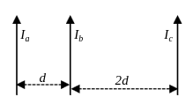

# TP8P9

Simulación de tres alambres paralelos infinitos con cálculo de fuerza magnética y campo magnético resultante por unidad de longitud.

## Enunciado

Tres alambres infinitos se disponen paralelos según se muestra en la figura. Suponiendo que por los alambres circulan corrientes con igual sentido, encontrar la fuerza por unidad de longitud que experimenta el alambre `b` debido a las corrientes que circulan por los alambres `a` y `c`.



## Qué hace

El script [simulacion_tres_alambres.py](/home/roberto/tp8p9/simulacion_tres_alambres.py) permite:

- ingresar `I_a`, `I_b` e `I_c` con signo;
- elegir sobre qué alambre (`a`, `b` o `c`) calcular la resultante;
- mostrar un resumen numérico en consola;
- dibujar una representación cartesiana con corrientes, fuerzas parciales, fuerza resultante y campo magnético resultante.

## Convenciones

- `I > 0` representa corriente en dirección `+j`.
- `I < 0` representa corriente en dirección `-j`.
- Las fuerzas sobre los alambres se reportan sobre el eje `x` usando `+i` o `-i`.
- El campo magnético perpendicular al plano se reporta usando `+k` o `-k`.
- En el gráfico, `⊙` representa `+k` y `⊗` representa `-k`.

## Geometría del problema

- Los alambres son rectas paralelas al eje `y`.
- Sus posiciones están sobre el eje `x`.
- Las ubicaciones son:
  `a` en `x = 0`, `b` en `x = d`, `c` en `x = 3d`.
- La separación entre `a` y `b` es `d`.
- La separación entre `b` y `c` es `2d`.

## Visualización

- Cada alambre tiene un color distinto.
- La flecha de cada corriente usa el color de su alambre.
- Cada componente de fuerza usa el color del alambre que la genera.
- La fuerza resultante se dibuja en rojo.
- El campo magnético resultante sobre el alambre objetivo se muestra junto al símbolo `⊙` o `⊗` con el color del alambre objetivo.

## Requisitos

- `uv`
- Python `>= 3.13`

Las dependencias están declaradas en [pyproject.toml](/home/roberto/tp8p9/pyproject.toml).

## Instalación

```bash
uv sync
```

## Ejecutable autocontenido

Podés generar un ejecutable nativo con `PyInstaller`. El resultado incluye el intérprete de Python y las dependencias del proyecto, pero sigue siendo específico por sistema operativo.

### Build local

Generá el binario sin modificar las dependencias del proyecto:

```bash
uv run --with pyinstaller pyinstaller --noconfirm --clean --onefile --name simulacion_tres_alambres simulacion_tres_alambres.py
```

El ejecutable queda en:

- Linux/macOS: `dist/simulacion_tres_alambres`
- Windows: `dist/simulacion_tres_alambres.exe`

### Build automático para Linux, Windows y macOS

El repositorio incluye el workflow [build-executables.yml](/home/roberto/tp8p9/.github/workflows/build-executables.yml), que compila el programa en:

- `ubuntu-latest`
- `windows-latest`
- `macos-latest`

Se ejecuta en:

- `push` a `main` o `master`;
- `pull_request`;
- ejecución manual con `workflow_dispatch`;
- tags que empiecen con `v`, por ejemplo `v1.0.0`.

Cada corrida publica tres artefactos descargables, uno por plataforma, desde la sección de artefactos de GitHub Actions.

Si el workflow corre sobre un tag que empiece con `v`, por ejemplo `v1.0.0`, además crea o actualiza el GitHub Release correspondiente y adjunta los tres binarios como assets descargables.

## Uso

Ejecutá:

```bash
uv run python simulacion_tres_alambres.py
```

El programa pide:

1. la separación base `d` en metros;
2. las corrientes `I_a`, `I_b`, `I_c` en amperes;
3. el alambre objetivo (`a`, `b` o `c`).

Los valores por defecto para las corrientes son:

```text
I_a = 3.0 A
I_b = 3.0 A
I_c = 3.0 A
```

## Ejemplo de entrada

```text
Separación base d en metros [Enter=1.0]:
Corriente I_a en amperes [Enter=3.0]: 4
Corriente I_b en amperes [Enter=3.0]: -2
Corriente I_c en amperes [Enter=3.0]: 1
Mostrar la resultante sobre qué alambre? [a/b/c, Enter=b]: a
```

## Ejemplo de salida

```text
Corrientes configuradas:
I_a = 4.000 A (+j)
I_b = -2.000 A (-j)
I_c = 1.000 A (+j)

Fuerzas sobre el alambre a:
F_ab/L = 1.600000e-06 N/m (-i)
F_ac/L = 2.666667e-07 N/m (+i)
F_a/L = -1.333333e-06 N/m (-i)

Campo magnético sobre el alambre a:
B_ab = 4.000000e-07 T (-k)
B_ac = 6.666667e-08 T (+k)
B_a = -3.333333e-07 T (-k)
```

## Modelo físico

La magnitud de la fuerza por unidad de longitud entre dos alambres paralelos es:

```text
F/L = mu0 * |I1 * I2| / (2 * pi * r)
```

donde `r` es la distancia entre alambres.

## Nota sobre Matplotlib

Si el entorno no permite escribir en la configuración de Matplotlib, usá:

```bash
MPLCONFIGDIR=.matplotlib uv run python simulacion_tres_alambres.py
```
